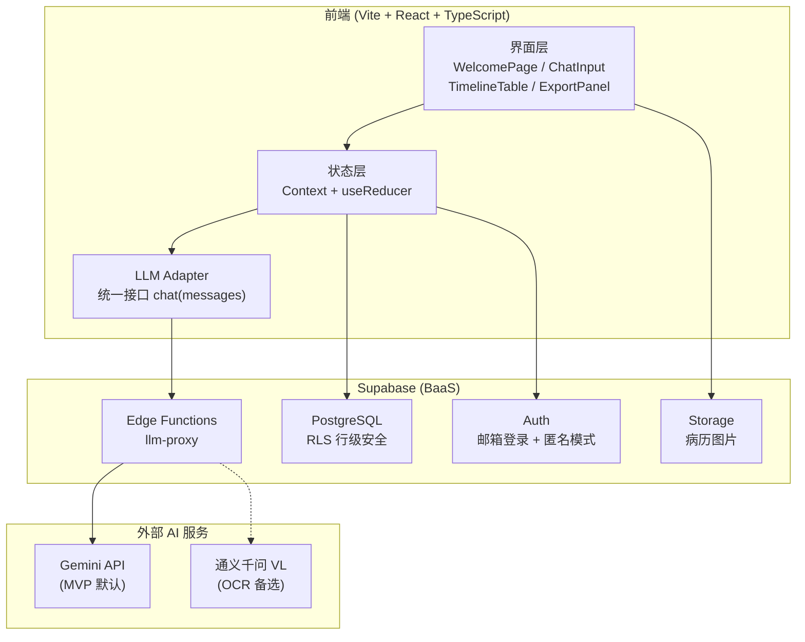
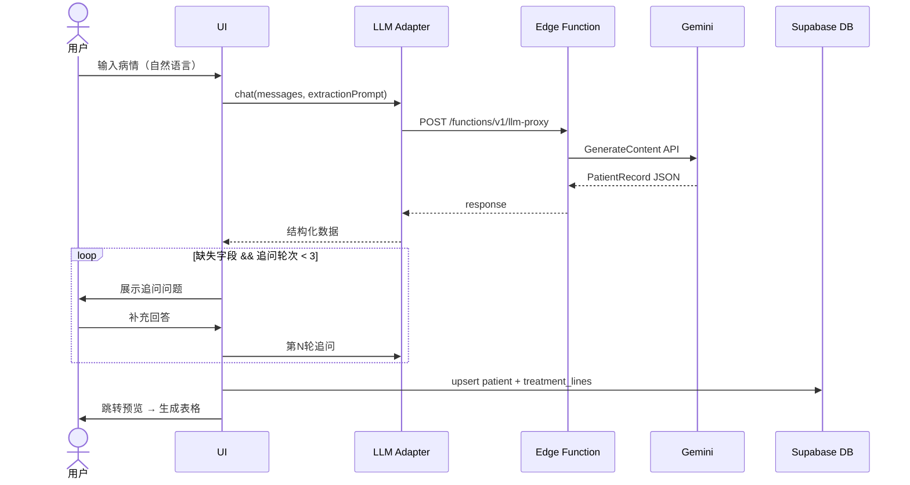

# 一页萤 (Firefly-Isle) — 实施计划

> 状态：历史参考文档（legacy reference）。当前实现范围、架构决策、执行任务与验收标准，均以 `openspec/changes/mvp-core/` 下的 `proposal.md`、`design.md`、`tasks.md` 与 `specs/` 为准。
>
> 使用方式：本文件可用于回顾早期思路、比较方案或提取仍然有价值的结构，但不得作为 `/opsx:apply` 或当前 MVP 实施的直接真相源。

## Context

本项目为晚期癌症患者/家属打造一个"一页纸治疗记录生成器"。患者面临多线治疗方案，信息过载，就诊时间短，需要一个工具快速生成极简治疗时间线表格，递给医生即可高效沟通。

**当前状态：** 本文件是历史参考文档。仓库已存在初始 Vite 基线（含 `package.json` 与 `src/`），但当前 MVP 的实现真相源仍是 `openspec/changes/mvp-core/`。
**开发工具链：** OpenSpec（已安装 v1.2.0）生成 Spec → Superpowers（已安装 v5.0.5）驱动实现 → Claude Code 编码

---

## 开发原则

> 本章节是全程开发的最高约束，所有 subAgent 和开发者必须遵守。Spec 是唯一真相源。

### 1. 每完成一个 Step 即 commit

commit 粒度对应 spec 大纲的 Step 编号，每完成一个 Step 提交一次：

```
Step 1.1 完成 → git commit -m "feat: Vite + React + Tailwind v4 搭建"
Step 1.2 完成 → git commit -m "feat: shadcn/ui 设计系统配置"
Step 2.1 完成 → git commit -m "feat: LLM Adapter 接口实现"
```

**commit 前置条件：** 该 Step 对应的单元测试全绿，无红测试进入 git history。

**不要**：每行代码、每个函数单独 commit（粒度过细，历史难以追溯）
**不要**：整个 Phase 完成才 commit（粒度过粗，出问题难以定位）

### 2. Spec 是活文档，可以修改，但必须先讨论

开发过程中发现 spec 要求不合理或与实现冲突时：
- **禁止**：悄悄绕过 spec，代码偷偷偏离
- **必须**：先与用户讨论，确认后修改 spec，再修改代码
- 代码和 spec 有矛盾时，以 spec 为准，同步修正代码

### 3. GEB 分形文档系统（三层注释）

每个代码文件必须维护 L3 头部注释契约：

```typescript
/**
 * [INPUT]: 依赖 {模块/文件} 的 {具体能力}
 * [OUTPUT]: 对外提供 {导出的函数/组件/类型/常量}
 * [POS]: {所属模块} 的 {角色定位}，{与兄弟文件的关系}
 * [PROTOCOL]: 变更时更新此头部，然后检查 CLAUDE.md
 */
```

每个模块目录必须有 `CLAUDE.md`（L2），项目根目录必须有 `CLAUDE.md`（L1）。代码变更必须同步更新文档，否则视为未完成。

### 4. subAgent 完成任务必须提供证据

不接受「已完成」的口头声明。每个任务完成后必须提供：
- 测试通过的终端输出（`vitest run` 结果）
- 关键文件的改动摘要
- 如有 E2E，提供 Playwright 测试结果

### 5. YAGNI — 不做 spec 没有要求的功能

- 禁止自作主张添加「顺手的优化」或「可能有用的功能」
- 禁止提前抽象「将来可能复用」的代码
- 发现潜在改进点 → 记录下来 → 告知用户 → 等待指令

### 6. 开发模式：SDD + TDD

- **SDD（Spec 驱动）**：Spec 定义做什么，AI 按 Spec 执行
- **TDD（测试驱动）**：每个功能先写测试，实现后跑通，证明做对了
- 两者不冲突：Spec 是外层框架（宏观），测试是内层纪律（微观）

```
Spec 明确功能需求
    ↓
subAgent 先写单元测试（红）
    ↓
subAgent 写最小实现（绿）
    ↓
commit
    ↓
下一个功能
```

---

## 已确认的决策

| 项目    | 决策                                                            |
| ----- | ------------------------------------------------------------- |
| 前端框架  | Vite + React + TypeScript + Tailwind CSS v4 + shadcn/ui       |
| 后端    | Supabase (Auth + PostgreSQL + RLS + Edge Functions + Storage) |
| AI 模型 | 保留统一 LLM Adapter 接口，MVP 默认接 Gemini API（通过 Supabase Edge Function 代理） |
| 数据存储  | Supabase 云端（非本地），支持未来移动端/小程序复用                                |
| OCR   | 仅打印体识别（Gemini Vision / 通义千问 VL）                               |
| 追问策略  | 交互式追问，最多 3 轮                                                  |
| 导出    | PDF + 图片                                                      |
| 原型工具  | Stitch 可选（快速原型，非锁定）                                           |
| 未来路线  | Web → 手机端 → 微信小程序                                             |

---

## 决策论证

> 本章节为「已确认的决策」表提供完整论证：候选方案对比、选择理由、已知缺陷与缓解策略。

### 决策 1: 前端框架 — Vite + React + TypeScript

**选择：** Vite + React 18 + TypeScript

| 候选方案 | 核心优势 | 核心劣势 | 适合场景 |
|---------|---------|---------|--------|
| ✅ Vite + React + TS | 生态最大、AI 工具链最成熟、招聘容易 | 无 SSR（CSR SPA） | 工具型 Web App |
| Next.js | SSR/SSG、SEO 友好、全栈一体 | 配置复杂、overkill for MVP | 内容型网站 |
| SvelteKit | 包体积小、性能极佳 | 生态小、AI 代码生成支持弱 | 性能极致场景 |
| Vue 3 + Vite | 上手快、中文社区活跃 | shadcn/ui 无官方 Vue 版 | 中文团队快速原型 |

**选择理由：** 本项目为工具型 SPA，无 SEO 需求；React 生态提供最丰富的 shadcn/ui 组件和 AI 代码生成支持；TypeScript 在数据模型复杂（PatientRecord、TreatmentLine）时提供类型安全保障。

**已知缺陷与缓解：** CSR SPA 导致 SEO 为零 → Landing Page 后期可单独用静态页处理，核心 App 功能无 SEO 需求。

---

### 决策 2: CSS 方案 — Tailwind CSS v4 + shadcn/ui

**选择：** Tailwind CSS v4 + shadcn/ui

| 候选方案 | 核心优势 | 核心劣势 | 适合场景 |
|---------|---------|---------|--------|
| ✅ Tailwind v4 + shadcn/ui | 组件直接复制进项目、无版本锁定、高度可定制 | v4 生态尚新，部分插件不兼容 | 需完全控制设计系统 |
| Tailwind v3 + shadcn/ui | 生态更稳定 | 版本即将过时 | 保守项目 |
| MUI / Ant Design | 开箱即用、组件丰富 | 样式定制难、包体积大 | 企业后台系统 |
| Chakra UI | 无障碍优秀、API 优雅 | 定制化受限 | 中小型产品 |

**选择理由：** shadcn/ui 将组件源码直接复制进项目，无第三方依赖锁定，可完全控制样式细节——对于需要高度定制化医疗表格布局至关重要；Tailwind v4 原生 CSS 变量方案与 shadcn/ui 完美配合。

**已知缺陷与缓解：** Tailwind v4 部分插件未适配 → 锁定精确版本号，避免自动升级；暂不使用需要 PostCSS 插件的高级功能。

---

### 决策 3: 后端 — Supabase

**选择：** Supabase（Auth + PostgreSQL + RLS + Edge Functions + Storage）

| 候选方案 | 核心优势 | 核心劣势 | 适合场景 |
|---------|---------|---------|--------|
| ✅ Supabase | 一体化 BaaS、RLS 行级安全、免费额度慷慨 | 供应商绑定、中国大陆访问延迟 | MVP 快速迭代 |
| 自建 Node + PostgreSQL | 完全控制、无供应商风险 | 运维成本高、Auth/Storage 需重建 | 大团队合规场景 |
| Firebase | 实时数据库强 | 无关系型查询、GCP 中国访问差 | 实时聊天/游戏 |
| PlanetScale + Clerk | 分层最优 | 多供应商管理复杂 | 高可用产品 |

**选择理由：** 单人 MVP 阶段运维成本是核心约束；Supabase RLS 在数据库层保证每行数据只有所有者可见；Edge Functions 可作为 AI API 的安全代理隐藏 API Key，无需独立后端。未来 Web→小程序路线，同一 Supabase API 无缝复用。

**已知缺陷与缓解：** 医疗数据隐私顾虑 → 隐私条款首屏明确告知 + RLS 确保数据隔离 + 可选匿名使用模式；中国大陆访问延迟 → 优先选择可用的 APAC region，并以目标用户链路实测结果确定最终节点。

---

### 决策 4: AI 接入 — LLM Adapter 接口

**选择：** 保留统一 LLM Adapter 接口，MVP 默认接 Gemini API via Supabase Edge Function

| 候选方案 | 核心优势 | 核心劣势 | 适合场景 |
|---------|---------|---------|--------|
| ✅ LLM Adapter（统一接口） | 切换模型成本 < 1天、API Key 不暴露前端 | 需维护 Adapter 层 | 长期产品、多模型策略 |
| 直接调用 Gemini API（前端） | 实现最简单 | API Key 暴露、无法切换模型 | 纯原型验证 |
| LangChain / LlamaIndex | 生态丰富、功能全 | 依赖重、学习曲线陡 | 复杂 RAG/Agent 场景 |
| Vercel AI SDK | Next.js 深度集成、流式响应优雅 | 绑定 Vercel 生态 | Next.js 项目 |

**选择理由：** AI 调用边界需要稳定，但 MVP 不需要多 provider 复杂度；保留统一 `chat(messages, options): Promise<string>` 接口，通过 Supabase Edge Function 代理隐藏 API Key，把模型细节收敛在单一边界内。

**已知缺陷与缓解：** Adapter 层增加代码量 → 接口极简（单一 `chat` 方法），MVP 阶段 Adapter 实现约 30 行。

---

### 决策 5: OCR 方案 — Gemini Vision / 通义千问 VL

**选择：** MVP 使用 Gemini Vision，备选通义千问 VL

| 候选方案                | 核心优势                             | 核心劣势              | 适合场景  |
| ------------------- | -------------------------------- | ----------------- | ----- |
| ✅ Gemini Vision（首选） | 与现有 LLM Adapter 复用、中文理解强、结构化输出稳定 | 手写体识别率较低          | 打印体病历 |
| 通义千问 VL（备选）         | 中文医疗文档训练充分、手写体更好                 | 需独立 API Key、增加供应商 | 手写体病历 |
| Google Vision OCR   | 打印体准确率高                          | 无语义理解、需后处理        | 纯文字提取 |
| Tesseract（开源）       | 零成本、离线                           | 中文医疗术语识别差         | 英文文档  |

**选择理由：** Gemini Vision 通过同一 LLM Adapter 接口调用，无额外后端形态成本；对于打印体病历（CT 报告、检验单），识别准确率满足 MVP 需求；通义千问 VL 作为备选，在手写体场景降级使用。

**已知缺陷与缺陷与缓解：** 手写体识别率低 → MVP 明确仅支持打印体，UI 提示「请上传打印或拍照清晰的报告」；手写体识别列入 P1。

---

### 决策 6: PDF 导出 — html2canvas + jsPDF

**选择：** html2canvas + jsPDF（纯前端方案）

| 候选方案 | 核心优势 | 核心劣势 | 适合场景 |
|---------|---------|---------|--------|
| ✅ html2canvas + jsPDF | 纯前端零服务器、跨浏览器 Canvas 渲染一致 | 位图 PDF（无法选中文字）、+250KB bundle | 无后端 MVP |
| Puppeteer/Playwright（服务端） | 矢量 PDF、像素完美 | 需 Node 服务器、运维成本 | 有后端的产品 |
| `window.print()` | 零依赖 | 浏览器打印样式差异大 | 简单打印场景 |
| @react-pdf/renderer | 矢量 PDF、纯前端 | 需重写布局（非 HTML/CSS 渲染） | PDF 为主要输出 |

**选择理由：** MVP 无后端渲染服务；html2canvas 将 DOM 截图为 Canvas 后转 PDF，布局与 Web 预览完全一致（WYSIWYG）；跨浏览器 Canvas 行为统一，优于 `window.print()` 的浏览器差异。

**已知缺陷与缓解：** 位图 PDF 无法文字选中 → 同时提供 PNG 图片下载（`toDataURL`，无额外依赖）。

---

### 决策 7: 数据存储 — Supabase 云端

**选择：** Supabase 云端（PostgreSQL + RLS），非浏览器本地存储

| 候选方案 | 核心优势 | 核心劣势 | 适合场景 |
|---------|---------|---------|--------|
| ✅ Supabase 云端 | 跨设备访问、数据不丢失、未来多端复用 | 需网络、医疗数据上云顾虑 | 多设备用户 |
| IndexedDB / localStorage | 完全离线、数据不离设备 | 清除浏览器即丢失、无跨设备 | 无账号工具 |
| 混合（本地优先 + 云同步） | 离线 + 跨设备兼顾 | 同步冲突逻辑复杂 | PWA 离线应用 |

**选择理由：** 目标用户场景包括「异地就医」，要求跨设备访问；同一 Supabase API 支持未来 Web → 手机端 → 小程序路线。

**已知缺陷与缓解：** 用户对医疗数据上云有顾虑 → 注册时隐私条款首屏弹窗明确说明存储位置；RLS 确保数据行级隔离；提供「匿名使用」模式（不注册，数据仅存本地）作为可选降级。

---

### 决策 8: 追问策略 — 最多 3 轮

**选择：** 交互式追问，最多 3 轮，超出通过二次编辑补充

| 候选方案 | 核心优势 | 核心劣势 | 适合场景 |
|---------|---------|---------|--------|
| ✅ 最多 3 轮追问 | 有明确边界感、覆盖三大信息块 | 极端情况下信息不完整 | 工具型产品 |
| 一次性提取（无追问） | 最快、API 成本最低 | 完整性依赖用户输入质量 | 高质量输入场景 |
| 无限追问 | 理论上信息最完整 | 用户疲劳、API 成本不可控 | 专业问诊助手 |

**选择理由：** 3 轮可覆盖三大核心信息块：① 肿瘤类型+分期，② 治疗线详情+时间，③ 免疫组化/基因检测结果；超过 3 次追问产生明显疲劳感；未提取的信息通过二次编辑表格补充（降级处理而非丢弃）。

**已知缺陷与缓解：** 3 轮后仍有关键信息缺失 → 预览页面对空白字段高亮提示「点击此处补充」。

---

### 决策 9: 部署 — Cloudflare Pages + GitHub Actions

**选择：** Cloudflare Pages（静态 SPA）+ Supabase Edge Functions + GitHub Actions CI/CD

| 候选方案 | 核心优势 | 核心劣势 | 适合场景 |
|---------|---------|---------|--------|
| Vercel | 零配置部署、PR Preview、免费额度、GitHub 深度集成 | 中国大陆访问速度慢 | 全球化产品 MVP |
| ✅ Cloudflare Pages | 全球 CDN 覆盖更好（含中国大陆周边）、Worker 可扩展、免费额度慷慨 | 配置比 Vercel 稍复杂 | 中国用户为主 |
| 腾讯云 COS + CDN | 中国大陆访问最快 | 运维复杂、需备案 | 国内合规产品 |
| Netlify | 功能类似 Vercel | 中国访问同样慢 | 同 Vercel |

**选择理由：** 目标用户主要在中国大陆；Cloudflare Pages 全球 CDN 在中国大陆周边节点覆盖好，访问延迟明显优于 Vercel；Cloudflare Worker 可扩展，未来可代理 Supabase API 进一步降低延迟；免费额度慷慨，MVP 阶段零成本；GitHub Actions 自动 lint/type-check/test/deploy 流水线，减少运维分心。

**已知缺陷与缓解：** 配置比 Vercel 稍复杂 → 使用官方 GitHub Action `cloudflare/pages-action` 标准化部署流程，配置成本可控。

---

## 系统架构

### 整体架构



### 核心数据流：自然语言 → 治疗时间线



---

## Phase 0: OpenSpec 规格化（~0.5 天）

**目标：** 将 prd.md 转化为可执行的 Spec 套件

### 步骤
1. `openspec init` — 初始化 OpenSpec，选择 `claude` 工具
2. 创建 MVP change，将 prd.md 内容作为输入
3. 生成 spec 套件：
   - `proposal.md` — 明确 MVP 范围（P0 in / P1-P2 out）
   - `specs/` — 按功能拆分的需求文件
   - `design.md` — 架构设计（数据流、组件层次、LLM Adapter 接口）
   - `tasks.md` — 可执行的开发任务列表
4. 用户审阅确认

### Exit Criteria（完成标准）

- [ ] `proposal.md` 明确列出 MVP in scope / out of scope 功能边界
- [ ] `specs/` 中每个 P0 功能有独立的需求文件
- [ ] `design.md` 包含 PatientRecord、TreatmentLine 字段定义和 LLM Adapter 接口签名
- [ ] `tasks.md` 中每个任务可在 1-4 小时内完成
- [ ] 用真实病历文本跑通 prompt 原型，提取准确率 > 80%

### 关键：数据模型需基于真实表格样例

从 prd.md 附件的表格样例出发，结合用户反馈，确立最终数据模型：

**所有患者使用同一套表格模板**，AI 根据患者情况自动填充对应区块。

```
PatientRecord
├── 基本信息（均可选）
│   ├── 性别、年龄、身高、体重
│   └── 肿瘤类型、确诊时间、临床分期
│
├── 初发区块（非晚期患者 / 复发晚期患者的初发记录）
│   ├── 触发时间（可选）
│   ├── 治疗方案（可选）
│   ├── 免疫组化（可选）
│   └── 基因检测（可选）
│
└── 治疗线区块[]（仅晚期患者，可无限添加）
    └── TreatmentLine
        ├── 线数（一线 / 二线 / 三线...）
        ├── 时间段（起止）
        ├── 用药方案
        ├── 穿刺（可选）
        ├── 免疫组化（可选）
        └── 基因检测（可选）
```

**三种患者情况的表格填充规则：**

| 情况 | 初发区块 | 治疗线区块 |
|------|---------|----------|
| 非晚期 | ✅ 有（含治疗方案） | ❌ 无 |
| 确诊即晚期（初发=一线） | ❌ 无 | ✅ 从一线开始 |
| 复发晚期 | ✅ 有（早期治疗记录） | ✅ 复发后一线起 |

**核心约束：**
- 免疫组化、基因检测**跟随每线治疗**，不在表格末尾统一显示
- 所有字段均为可选，AI 只提取用户实际提供的信息
- 未填字段在表格中留白，预览页高亮提示补充

### 产出
```
.openspec/
├── config.yaml
└── changes/mvp-core/
    ├── proposal.md
    ├── specs/
    │   ├── data-model.spec.md        ← 核心数据模型（基于真实表格）
    │   ├── info-extraction.spec.md   ← NLP 提取规则
    │   ├── timeline-table.spec.md    ← 表格渲染规则
    │   ├── editing.spec.md           ← 二次编辑
    │   ├── export.spec.md            ← 导出
    │   ├── llm-adapter.spec.md       ← LLM 适配器接口
    │   └── supabase-schema.spec.md   ← 数据库设计
    ├── design.md
    └── tasks.md
```

---

## Phase 1: 基础设施搭建（~1-2 天）

**目标：** 从零搭建可运行的开发环境 + 设计系统 + Supabase

### Step 1.0 — Stitch 约束确认

- 读取 `docs/products/stitch-screen-mapping.md`
- 仅确认 MVP 设计约束：只做 6 个 Web 原型、Mobile 暂不参考、页面真名只认 `screenInstances.label`
- 如需页面细节，通过 `sourceScreen -> get_screen(...)` 读取底层资源
- 这一阶段只做**约束确认**，不提前细化页面 token 与视觉还原

### Step 1.1 — Vite + React + Tailwind v4 脚手架
**参考：** web-design skill「网站初始化」

```bash
npm create vite@latest . -- --template react-ts
npm install tailwindcss @tailwindcss/vite
npm install framer-motion lucide-react clsx tailwind-variants react-icons
npm install react-router-dom
```

- 配置 `vite.config.ts`（Tailwind plugin + path alias）
- 配置 `src/index.css`（`@import "tailwindcss"` + CSS variables）
- 配置 `tsconfig.json`（`@/` path alias）

### Step 1.2 — shadcn/ui 设计系统
**参考：** web-design skill「设计系统」+「设计提升」

- `npx shadcn@latest init`
- 从 tweakcn 导入温暖色调主题（适合医疗关怀应用）
- **在此阶段就确定配色与主题 token**，避免后续返工
- 主题策略固定为：**默认 Dark，允许手动切换到 Light，并记住用户上次选择**
- 分批安装组件（6 批次，每批 ≤6 个）
- 优先沉淀共享 token、布局骨架和可复用表格样式，而不是一次性堆叠装饰效果
- 视觉方向允许追求更强的高级感、层次与材质表达；必要时可在骨架稳定后结合 `frontend-design` 做一次集中设计提升 pass

### Step 1.3 — Supabase 初始化
**参考：** web-design skill「Supabase 集成」

- 安装 `@supabase/supabase-js`
- 创建 `src/lib/supabase.ts`
- 认证方案使用 **邮箱登录 + 匿名模式**，不使用 Google OAuth
- 数据库 schema 与当前 OpenSpec 保持一致：
  - `patients` — 患者基本信息与初发区块
  - `treatment_lines` — 治疗线数据
- RLS 策略：`auth.uid() = user_id`

### Step 1.4 — 路由 & 布局骨架

```
路由结构：
/login         → 登录页
/app           → 主应用（需登录）
/record/:id    → 单条记录查看/编辑
```

- `ProtectedRoute` 组件
- `AppLayout`（workspace shell）
- 先搭建登录页 / 临床工作区 / 档案详情的基础布局骨架
- 主题切换入口属于应用壳层的一部分，不引入 LLM provider 设置页

### Step 1.5 — Stitch 细化对齐

- 在应用壳层与基础路由稳定后，再回到 Stitch 的 6 个 Web 原型
- 提炼 3 套页面结构与 1 套共享主题 token
- 避免按 6 张原型重复实现 6 套页面，而是做结构复用 + 主题映射

### Step 1.6 — GEB 文档系统初始化
- 创建 L1 `CLAUDE.md`（项目全局）
- 为主要目录创建 L2 `CLAUDE.md`
- 建立 L3 文件头注释规范（INPUT/OUTPUT/POS）

### 产出目录结构
```
Firefly-Isle/
├── CLAUDE.md                          # L1
├── index.html
├── package.json
├── vite.config.ts
├── tsconfig.json
├── .env.local                         # Supabase keys (gitignored)
├── .env.example
├── supabase/migrations/
│   └── 001_initial_schema.sql
└── src/
    ├── main.tsx
    ├── App.tsx
    ├── index.css                      # Tailwind + theme CSS vars
    ├── routes/
    │   ├── index.tsx
    │   └── ProtectedRoute.tsx
    ├── layouts/
    │   └── AppLayout.tsx
    ├── pages/
    ├── components/ui/
    ├── lib/
    │   ├── supabase.ts
    │   └── utils.ts
    └── types/
        └── patient.ts
```

---

## Phase 2: MVP 核心功能（~5-8 天）

### 验收清单（TDD — 每小功能完成即测试）

**Step 2.1 — LLM Adapter**
- Given: mock Gemini 响应为结构化文本 JSON 字符串
- When: 调用 `chat(messages)`
- Then:
  - [ ] 返回字符串结果，可被后续 JSON 解析逻辑消费
  - [ ] 非 2xx 响应时抛出可识别错误类型
  - [ ] 测试命令：`vitest run src/lib/llm-adapter.test.ts`

**Step 2.2 — Prompt 工程 & 结构化提取**
- Given: 输入「我妈妈2021年7月确诊乳腺癌三期，做了AC方案4次化疗」
- When: 调用 `extractPatientRecord(text)`
- Then:
  - [ ] 返回 `PatientRecord`，`tumorType` 包含「乳腺癌」
  - [ ] `diagnosisDate` 包含「2021」
  - [ ] `stage` 包含「三期」
  - [ ] 治疗线数组长度 >= 1，第一线 `regimen` 包含「AC」
  - [ ] 测试命令：`vitest run src/features/extraction/extractor.test.ts`

**Step 2.3 — 追问机制**
- Given: 首轮提取后 `stage` 字段为空
- When: 系统触发追问
- Then:
  - [ ] 生成追问问题，问题中包含「分期」相关词
  - [ ] 追问轮次计数器 +1
  - [ ] 第 4 次追问不触发，改为标记字段留白
  - [ ] 测试命令：`vitest run src/features/extraction/follow-up.test.ts`

**Step 2.4 — 主题系统**
- Given: 首次访问应用
- When: 未存在用户主题偏好
- Then:
  - [ ] 默认使用 Dark 主题
  - [ ] 用户手动切换到 Light 后刷新页面，恢复上次选择
  - [ ] 测试命令：`vitest run src/features/theme/theme-switch.test.tsx`

**Step 2.5 — TimelineTable 组件**
- Given: 传入包含 3 条治疗线的 `PatientRecord`
- When: 渲染 `<TimelineTable record={mockRecord} />`
- Then:
  - [ ] 渲染 3 行治疗线数据
  - [ ] 每行包含线数、时间段、用药方案
  - [ ] 含免疫组化数据的行显示免疫组化区块
  - [ ] 空字段显示占位提示而非报错
  - [ ] 测试命令：`vitest run src/features/timeline/TimelineTable.test.tsx`

**Step 2.6 — 预览编辑 ExtractionPreview**
- Given: 渲染预览页，空白字段高亮
- When: 点击空白字段
- Then:
  - [ ] 字段变为可编辑 input
  - [ ] 编辑后 blur，值保存至 PatientRecord
  - [ ] 测试命令：`vitest run src/features/preview/ExtractionPreview.test.tsx`

**Step 2.7 — 导出功能 ExportPanel**
- Given: 渲染完整表格
- When: 点击「导出 PDF」
- Then:
  - [ ] 调用 `html2canvas` + `jsPDF`，生成文件名含日期的 PDF
  - [ ] 点击「导出图片」，生成 PNG 文件
  - [ ] 导出期间按钮显示 loading 状态
  - [ ] 测试命令：`vitest run src/features/export/ExportPanel.test.tsx`


> **并行说明：** Phase 2（AI 核心）与 Phase 3（前端 UI）可并行开展。LLM Adapter 接口签名确定后，前端用 mock 数据驱动 UI，不需要等待 AI 核心完成。

**目标：** 实现 5 大 P0 功能
**工具链：** Superpowers 驱动（brainstorm → plan → subagent → TDD → review）

### Step 2.1 — LLM Adapter 基础层

所有 AI 功能的底座。

```typescript
// src/lib/llm/types.ts
interface Message {
  role: 'system' | 'user' | 'assistant'
  content: string
}

interface ChatOptions {
  model?: string
}

function chat(messages: Message[], options?: ChatOptions): Promise<string>
```

- 保留极薄的 adapter 边界，统一对外暴露 `chat(messages, options)`
- MVP 仅实现 Gemini API adapter，不实现多 provider 路由
- **API Key 安全：** 通过 Supabase Edge Function 代理，前端不暴露 key
- `options.model` 允许覆盖具体 Gemini 模型名，但不提供用户设置页切换 provider

**关键文件：**
- `src/lib/llm/types.ts` — 接口定义
- `src/lib/llm/index.ts` — 统一导出 `chat` 封装
- `src/lib/llm/prompts/` — 各场景 prompt
- `supabase/functions/llm-proxy/index.ts` — Edge Function

### Step 2.2 — 核心数据模型 & 状态管理

基于 OpenSpec 中 `PatientRecord` / `TreatmentLine` 的统一模型：

```typescript
interface PatientRecord {
  id: string
  basicInfo?: {
    gender?: string
    age?: number
    height?: number
    weight?: number
    tumorType?: string
    diagnosisDate?: string
    stage?: string
  }
  initialOnset?: {
    triggerDate?: string
    treatment?: string
    immunohistochemistry?: string
    geneticTest?: string
  }
  treatmentLines: TreatmentLine[]
}

interface TreatmentLine {
  lineNumber: number
  startDate?: string
  endDate?: string
  regimen: string
  biopsy?: string
  immunohistochemistry?: string
  geneticTest?: string
}
```

- 状态管理：React Context + useReducer（不引入第三方库）
- Supabase CRUD hooks

**关键文件：**
- `src/types/medical.ts`
- `src/hooks/usePatientRecords.ts`
- `src/contexts/RecordContext.tsx`

### Step 2.3 — Feature 1: 自然语言输入 → 结构化提取

**核心交互：** 干净界面 → 输入框 + 引导语 → AI 提取 → 追问（≤3轮）→ 结构化预览

- Prompt 工程需理解中文医学术语（肿瘤类型、分期系统、药物名）
- 输出必须匹配 `PatientRecord` schema
- 追问策略：识别缺失字段，生成针对性问题

**关键文件：**
- `src/features/input/InputPage.tsx`
- `src/features/input/NaturalLanguageInput.tsx`
- `src/features/input/FollowUpChat.tsx`
- `src/features/input/ExtractionPreview.tsx`
- `src/lib/llm/prompts/extraction.ts`

### Step 2.4 — Feature 2: 一键生成极简表格

**核心：** 结构化数据 → 一页纸可打印表格

- 布局严格参照 prd.md 附件表格样例的结构
- 自动适配一页（字号/间距自动缩放）
- `@media print` 专用样式

**关键文件：**
- `src/features/timeline/TimelineTable.tsx`
- `src/features/timeline/PatientInfoHeader.tsx`
- `src/features/timeline/TreatmentLineRow.tsx`
- `src/features/timeline/print.css`

### Step 2.5 — Feature 3: 二次编辑

当前 MVP 仅支持：
1. **手动 inline edit** — 点击单元格直接修改

**不包含：** AI 对话式修正（降级到后续阶段）

**关键文件：**
- `src/features/editing/EditableTimeline.tsx`

### Step 2.6 — Feature 4: 导出（PDF + 图片）

- PDF: `html2canvas` + `jsPDF`
- 图片: `html2canvas` → PNG
- DOC 格式 MVP 不做（复杂度高收益低）

**关键文件：**
- `src/features/export/ExportPage.tsx`
- `src/hooks/usePdfExport.ts`
- `src/hooks/useImageExport.ts`

### 可并行的工作
- 导出与表格编辑可并行开发

---

## Phase 3: 集成验证与体验收口（~1-2 天）

### 验收清单

**Step 3.1 — 核心流程集成验证**
- Given: 用户完成登录并输入病历文本
- When: 执行主流程
- Then:
  - [ ] 文字输入 → 提取 → 追问 → 渲染 → 编辑 → PDF 导出全链路可用
  - [ ] 测试命令：`playwright test`

**Step 3.2 — 数据与权限验证**
- Given: 两个不同账号与一个匿名账号
- When: 访问记录数据
- Then:
  - [ ] RLS 生效，用户 A 无法读取用户 B 的数据
  - [ ] 匿名模式刷新后 session 与记录恢复正常

**Step 3.3 — 主题与隐私门控验证**
- Given: 首次访问或已存在本地偏好
- When: 刷新或重新进入应用
- Then:
  - [ ] 默认 Dark
  - [ ] Light / Dark 手动切换后恢复上次选择
  - [ ] 隐私政策门控按预期阻塞/放行

---

## Phase 4: 部署（~1 天）

### Step 4.1 — 部署与验收
- **Hosting：** Cloudflare Pages（静态 SPA + Supabase Edge Functions）
- **CI/CD：** GitHub Actions（lint + type-check + test → 自动部署至 Cloudflare Pages）

### Step 4.2 — 上线 Checklist
- [ ] 所有当前 MVP 功能手动验收
- [ ] PDF 导出跨浏览器验证
- [ ] Supabase RLS 安全审查
- [ ] 基础隐私条款页面
- [ ] 主题切换与本地持久化验证

---

## 风险矩阵

| # | 决策 | 风险 | 影响 | 概率 | 缓解策略 |
|---|------|------|------|------|----------|
| 1 | React CSR | SEO 为零 | 低（工具型产品） | 高 | 当前 MVP 接受；如后续需要品牌落地页，再单独处理 |
| 2 | Tailwind v4 | 生态尚新，部分插件不兼容 | 中 | 中 | 锁定精确版本号，避免自动升级 |
| 3 | Supabase | 医疗数据隐私顾虑 | 高 | 中 | RLS 行级隔离 + 首屏隐私条款弹窗 |
| 3b | Supabase 访问延迟 | 中国大陆用户响应慢（数据库+Edge Functions） | 高 | 高 | **方向 A（已选）**：① 优先选择可用的 APAC region，并以实测确定最终节点；② pgBouncer 连接池；③ 前端乐观更新（optimistic update），写操作先更新本地状态后台同步；④ Edge Function 热点读结果加 Cache-Control |
| 4 | LLM Adapter | Gemini API 变更/涨价 | 中 | 低 | Adapter 层隔离，切换成本 < 1天 |
| 5 | Gemini Vision OCR | 中文手写体识别率低 | 高 | 高 | MVP 仅支持打印体；手写体列入 P1 |
| 6 | html2canvas PDF | 位图 PDF 无法文字选中 | 低 | 确定 | 同时提供 PNG 图片下载 |
| 7 | Supabase 云存储 | 用户对医疗数据上云有顾虑 | 高 | 中 | 首屏弹窗告知 + 匿名模式降级 |
| 8 | 3 轮追问上限 | 关键信息未提取 | 中 | 中 | 预览页空白字段高亮提示补充 |
| 9 | Vercel 部署 | 中国大陆访问速度慢 | 高（目标用户） | 高 | 规模化前迁移 Cloudflare Pages |
| — | 中文医学术语提取 | 提取准确率不足影响核心功能 | 高 | 中 | Phase 0 结束后用真实病历做 prompt 原型测试 |
| — | 一页纸内容溢出 | 表格超出单页 | 中 | 中 | 自动缩放 + 多页 fallback |

---

## 执行入口

Phase 0 第一步：在项目根目录执行 `openspec init`，然后用 OpenSpec 将 prd.md 转化为完整 Spec 套件。

预估总工时：**10-16 天**（单人全职 + AI agent）
