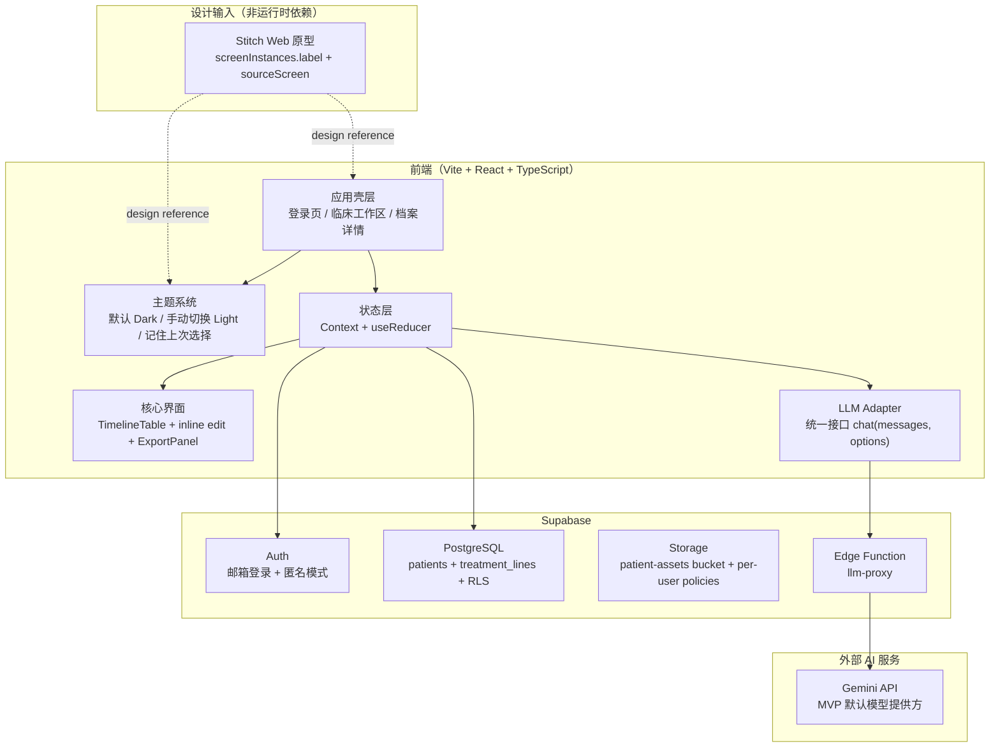
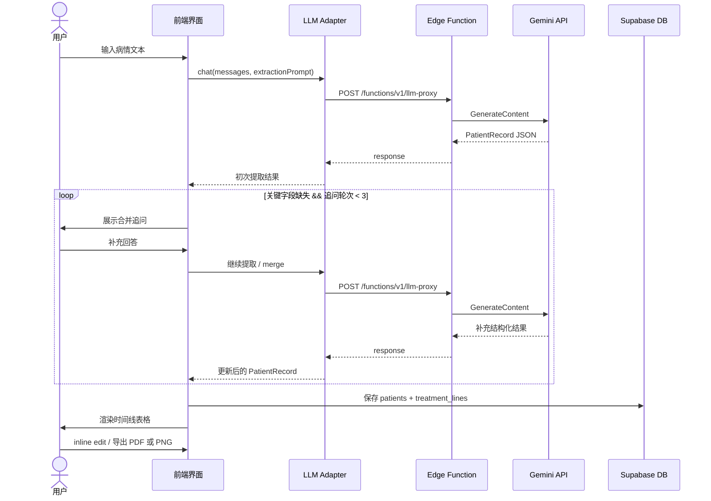

## Context

一页萤是一个面向晚期癌症患者/家属的治疗记录生成器。患者面临多线治疗方案、信息过载、就诊时间极短的困境，需要一个工具快速生成一页纸治疗时间线表格递给医生。

**当前状态：** Greenfield 项目，已建立初始仓库基线（含 `package.json`、`src/`、Vite 基础文件与 OpenSpec 工件），但 MVP 能力仍基本未实现；当前 OpenSpec 已包含 proposal、design、tasks 与 12 个 capability specs，作为本轮 MVP 的主要真相源。

**用户群体约束：** 晚期癌症患者/家属，情感极度脆弱，UI 必须简洁、无干扰、可信赖。错误提示需温和，绝不暴露技术细节。

**视觉方向约束：** 前端视觉可以追求高级感、质感与设计完成度，允许适度炫技；但所有视觉表达都必须服务于信息可读性、主流程清晰度与医疗场景下的可信赖感，不得喧宾夺主或破坏编辑、提取、导出等核心体验。

**核心约束：** MVP 要快、稳、简单。不为假想的 P2 需求设计抽象层。

## Goals / Non-Goals

**Goals:**
- 自然语言输入 → 结构化 `PatientRecord` 提取（Gemini API，max 3 轮追问）
- 治疗时间线表格渲染（支持非晚期、确诊即晚期、复发晚期三种 archetype）
- 表格字段内联编辑 + 空字段高亮提示
- PDF + PNG 导出（纯前端，html2canvas + jsPDF）
- Supabase 云端存储（patients + treatment_lines 表，RLS 行级安全）
- Supabase Storage 基础设施（bucket + 基于用户隔离的访问策略），为后续患者资源扩展保留边界
- 用户认证：邮箱登录 + 匿名模式
- 隐私政策门控（首次启动弹窗，localStorage flag，阻塞主功能）
- 主题系统：默认 Dark，允许手动切换到 Light，并记住用户上次选择

**Non-Goals:**
- 手机端 / 微信小程序（P2 路线图，不在 MVP 内）
- 多语言支持
- 手写体 OCR（仅支持打印体，Gemini Vision / 通义千问 VL）
- LLM Adapter 用户可配置界面（P2，MVP 默认接 Gemini API）
- 离线模式
- 团队协作 / 多用户共享记录

## UI Reference Source

- Stitch 在本项目中是**设计输入**，不是前端运行时依赖；React 应用不应在运行时连接 Stitch MCP。
- MVP 前端只参考 `docs/products/stitch-screen-mapping.md` 中的 6 个 **Web** 原型：`登录页面 / 临床工作区 / 档案详情` × `Dark / Light`。
- Mobile 原型当前不进入 MVP 实现输入，只作为后续移动端阶段的参考。
- 页面名称以 `screenInstances.label` 为唯一真相源；若需要读取页面 HTML、截图或结构细节，先由页面名称解析到 `sourceScreen`，再读取 `get_screen(name=sourceScreen)`。
- 前端实现目标是 **3 套页面结构 + 1 套共享主题 token 系统**，而不是按 6 张原型重复实现 6 套页面。
- 设计原型对 **信息架构、页面区域划分、主题方向与关键视觉元素** 具有强约束；实现时不做像素级机械临摹，而是在保持结构忠实的前提下，用工程化组件与 token 体系重建高级感与设计表达。
- Light / Dark 主题切换属于 MVP 范围，默认 Dark，允许用户手动切换到 Light，并记住上次选择；该能力需在设计系统阶段纳入，而不是在页面完成后补做皮肤层。

## Scope Clarifications

- OCR / 图片上传不属于当前 MVP 主线，维持为 P1 能力；当前 MVP 只要求文字输入提取流程。
- PRD 中提到的“输入框中对话式修改（AI 交互修正）”不纳入当前 MVP；本轮仅实现 inline edit。
- Stitch 规则不仅是参考备注，也是实现约束：MVP 仅使用 6 个 Web 原型作为设计输入，不展开 Mobile 实现。

## Architecture

### Documentation synchronization protocol

- 对当前 change 而言，代码与文档必须保持同构：架构级变更未同步到相关文档层，视为变更未完成。
- 文档分三层维护：L1 为根 `CLAUDE.md`（项目全局架构与顶层模块），L2 为模块级 `CLAUDE.md`（局部结构、职责、暴露接口），L3 为关键业务文件头部契约（INPUT / OUTPUT / POS）。
- 当发生以下任一情况时，必须同步文档：文件创建 / 删除 / 移动 / 重命名；模块职责变化；接口或契约变化；顶层技术栈或目录结构变化。
- 实施时进入新模块前，优先读取对应目录的 `CLAUDE.md`；修改关键业务文件时，检查其 L3 头部契约是否仍与实现一致。
- 对涉及架构级变化的任务，完成定义不仅包括代码正确，也包括受影响的 L1 / L2 / L3 文档已经更新并与现实一致。

### README synchronization

- README 是面向人类协作者的项目入口文档，不要求跟随每个小范围实现细节变动同步更新。
- 当本次 change 改变了项目的运行方式、环境变量、外部依赖、核心主流程、MVP 能力边界或当前阶段状态时，README 必须同步更新。
- 对当前 change 而言，README 更新属于文档同步协议的一部分；若相关信息已发生变化而 README 仍停留在旧状态，则该变更视为未完全收口。
- README 应聚焦“如何理解、如何启动、如何使用、当前做到哪一步”，不承载模块级实现细节；模块细节仍由 `CLAUDE.md`、spec 与代码承担。

### Apply execution cadence

- `mvp-core` 的 apply 默认采用 **主 agent 持续掌握全局真相源** 的方式推进，而不是把整条变更完全分散给多个并行 agent。
- 在 **骨架与边界仍在成形** 的阶段（脚手架、主题系统、路由、应用壳层、Stitch 结构对齐、核心数据模型、数据库结构、认证主链路），优先由主 agent 串行推进，避免真相源分裂。
- 在 **接口与边界已经稳定** 之后（LLM 代理封装、信息提取、表格渲染、导出、测试补齐），允许主 agent 保持总控，同时将窄边界任务委派给少量子 agent 并行处理。
- 子 agent 适合承担：独立测试补充、局部模块实现、问题调查与 second opinion；不适合在当前 change 仍频繁调整 spec / design / tasks 时主导整段实现。
- 任何并行协作都必须服从当前 change 的 commit cadence 与 recommended commit map，由主 agent 负责最终整合、验收与提交判断。

### System architecture

### Core MVP flow

## Decisions

### 1. 前端框架：Vite + React 18 + TypeScript

**选择理由：** 无 SSR 需求（纯 SPA，数据来自 Supabase 客户端），Vite 构建更快，热更新体验优于 CRA。TypeScript 在数据模型（PatientRecord 接口）上提供类型安全保障。

**对比 Next.js：** Next.js 的 SSR/ISR 对本项目无价值，反而引入了服务端部署复杂度。Cloudflare Pages 部署静态 SPA 比 Next.js 更简单。

### 2. CSS 方案：Tailwind CSS v4 + shadcn/ui

**选择理由：** shadcn/ui 组件无运行时依赖，直接复制到项目中可完全掌控样式，适合高度定制的医疗场景 UI。Tailwind v4 性能更好，JIT 模式默认开启。

**对比 MUI：** MUI 组件库体积大，覆盖样式成本高，且 Material Design 风格不适合「温暖、人性化」的医疗产品定位。

### 3. 后端：Supabase（Auth + PostgreSQL + RLS + Edge Functions）

**选择理由：** Supabase 内置 Auth、行级安全、Edge Functions，MVP 阶段零后端代码。RLS 策略确保用户只能访问自己的数据，无需在应用层写权限逻辑。

**对比自建 Express API：** 自建 API 需要额外维护认证中间件、数据库连接池、部署运维。MVP 阶段这些都是不必要的复杂度。

### 4. LLM 调用：通过 Supabase Edge Function 代理

**选择理由：** Gemini API Key 不能暴露在前端代码中。Edge Function 作为轻量代理层，验证 Supabase JWT 后转发请求，同时隐藏 API Key。

**对比直接前端调用：** 直接在前端调用 Gemini API 会暴露 API Key（可被 DevTools 提取），安全风险不可接受。

**对比独立后端服务：** Edge Function 与 Supabase Auth 天然集成，无需额外部署，延迟也更低（与数据库同区域）。

### 5. LLM 配置：保留统一 Adapter 接口，MVP 默认接 Gemini API

**选择理由：** 提取与追问逻辑不应该直接依赖具体 SDK 细节；保留极薄的 `chat(messages, options)` 适配层，可以把模型调用边界锁在一处，同时不引入多 provider 路由的过度设计。MVP 默认只接 Gemini API，通过 `options.model` 允许同一家模型族内切换具体型号。

**边界约束：** MVP 不实现 Qwen/OpenAI/Claude 之外的多 provider handler，不提供用户可配置 provider 界面。若未来确有多模型需求，再扩展 Edge Function 路由。

### 6. PDF 导出：html2canvas + jsPDF（纯前端）

**选择理由：** 无需服务端渲染，零部署成本，对 MVP 场景（单次导出，无批量需求）足够。

**对比 Puppeteer/Playwright 服务端截图：** 需要额外服务器，增加运维复杂度。MVP 不值得。

**已知局限：** html2canvas 对复杂 CSS（如渐变、shadow）渲染精度有限。解决方案：导出专用样式表，避免复杂 CSS，固定 scale=2 保证清晰度。

### 7. 部署：Cloudflare Pages + GitHub Actions

**选择理由：** Cloudflare CDN 节点覆盖中国大陆周边（香港、东京），延迟低于 Vercel。静态 SPA 部署到 Cloudflare Pages 成本极低（免费套餐足够 MVP）；GitHub Actions 负责在提交后串联 lint / type-check / test / deploy，减少手动发布误差。

**对比 Vercel：** Vercel 在中国大陆访问速度不稳定，对目标用户群体不友好。

## Phase exit criteria

### Phase 1 — 基础设施搭建完成标准
- 前端脚手架可运行，主题系统已建立，默认 Dark / 手动切换 Light / 恢复上次选择可验证。
- 登录页、临床工作区、档案详情三类页面的基础布局骨架已经形成。
- Stitch 的 Web-only 设计输入规则已经落地到页面结构与主题对齐策略中。
- Supabase 客户端与环境变量基础配置已经就绪。

### Phase 2 — MVP 核心功能完成标准
- 文字输入 → 结构化提取 → 最多 3 轮追问 → 时间线渲染 主链路可用。
- inline edit、PDF 导出、PNG 导出均已可用。
- `PatientRecord`、数据库结构与前端渲染之间的数据边界已经稳定。

### Phase 3 — 集成验证完成标准
- 核心流程、RLS、匿名模式、隐私门控、主题系统恢复行为均已验证通过。
- 若本轮涉及架构级变化，L1 / L2 / L3 文档已同步更新并通过一致性检查。

### Phase 4 — 部署完成标准
- 当前 MVP 功能已完成手动验收。
- GitHub Actions 与 Cloudflare Pages 部署链路可用，基础隐私条款页面已就绪。
- 导出跨浏览器验证与 Supabase RLS 安全审查已完成。
- 若当前 MVP 仅保留 Storage 基础设施边界，则 bucket 与访问策略已验证；若后续扩展患者资源上传流程，不在本阶段完成标准内。

## Risk matrix

| 风险 | 影响 | 概率 | 缓解策略 |
|------|------|------|----------|
| LLM 提取准确率不稳定，关键字段缺失 | 高 | 中 | 追问机制（最多 3 轮）+ 空字段高亮 + inline edit 补全 |
| Supabase Edge Function 冷启动延迟 | 中 | 中 | 接受 MVP 低频场景；通过 loading 状态提示用户 |
| html2canvas 导出与屏幕显示差异 | 中 | 中 | 导出专用样式表 + 固定 scale=2 + 导出验收 |
| 匿名用户数据丢失（浏览器清理本地数据） | 高 | 中 | UI 明确提示匿名模式风险 |
| Gemini API 费用或配额变化 | 中 | 低 | Adapter 层隔离 + Edge Function 层限流或模型切换 |
| Tailwind v4 生态不稳定 | 中 | 中 | 锁定版本，不追逐 breaking changes |
| 中国大陆访问 Supabase / Edge Function 延迟 | 高 | 高 | 优先选择可用的 APAC region，并基于中国大陆链路实测确定最终节点；同时优化主链路等待体验 |
| 一页纸内容溢出 | 中 | 中 | 表格布局控制 + 导出前验收 + 必要时收紧内容密度 |

## Open Questions

1. **Supabase 项目 region**：优先选择可用的 APAC region，并根据中国大陆目标用户的实际网络测试结果确定最终 region。
2. **隐私政策文本**：MVP 用占位符，正式上线前需法务审核。
